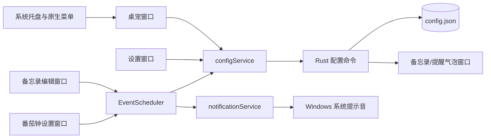

# Desktop Pet

一个基于 **Tauri 2 + React + TypeScript + Rust** 开发的轻量级 Windows 桌面宠物。

建议使用透明PNG/WebP图片素材，可以在Windows桌面上提供常驻桌宠、待机切换、备忘录、定时提醒、番茄钟和软件快捷启动等功能。应用完全本地运行，此版本不包含 AI、聊天、联网、云同步或语音助手等功能，属于某种意义上的白模。

当前版本：**V1.1.1**

## 支持平台

- Windows 10
- Windows 11
- x64

## 技术栈

- [Tauri 2](https://tauri.app/)：桌面窗口、系统托盘和原生能力
- React：界面组件
- TypeScript：前端业务逻辑与类型定义
- Vite：前端开发和构建
- Rust：配置持久化、窗口管理、托盘菜单、安全启动程序和 Windows 系统提示音
- WebView2：Windows WebView 运行时

## 项目目标

Desktop Pet 的定位是：

> 桌面常驻+简单、低干扰的个人工具。

- 白模，未引入复杂状态框架
- 所有数据保存在本地
- 提醒和番茄钟基于绝对时间恢复，不依赖长时间 `setTimeout`
- 快捷启动只能运行用户明确添加的 `.exe` 文件
- 桌宠、设置、编辑器和显示气泡使用独立窗口
- 尽量复用已有气泡与事件能力，避免创建复杂界面

## 已实现功能

### 桌宠窗口

- 透明背景
- 无边框、无标题栏
- 默认始终置顶
- 不显示普通任务栏按钮
- 支持鼠标拖动
- 松开鼠标后保存桌面位置
- 可锁定位置，锁定后禁止拖动
- 支持 50%、75%、100%、125%、150% 等比例缩放
- 自动恢复位置、大小和置顶设置

### 图片与互动

- 从 `src/assets/pet/idle/` 自动发现PNG/WebP图片
- 文件编号不要求连续
- 定时切换待机图片
- 图片预加载，减少切换时闪烁
- 只有一张待机图时仍可正常运行
- 双击桌宠进入互动模式
- 互动模式优先显示 `selected.png`
- 方向键每次移动 10px
- `Shift + 方向键` 每次移动 50px
- `Esc` 退出互动模式
- 到达提醒时间时切换为选中状态，提供视觉反馈

### 系统托盘

托盘菜单支持：

- 显示桌宠
- 隐藏桌宠
- 调整桌宠大小
- 切换始终置顶
- 切换开机启动
- 打开设置
- 退出程序

### 番茄钟

- 从桌宠右键菜单开启
- 支持15、25、45、60分钟预设
- 支持1–1440分钟自定义时长
- 桌宠旁边显示“专注中”和剩余时间
- 可以隐藏或恢复倒计时气泡
- 可以提前关闭当前番茄钟
- 结束后显示“专注完成”提醒气泡
- 提醒气泡支持关闭或立即开始新一轮
- 保存开始时间、结束时间、时长和运行状态
- 程序重启后根据结束时间恢复正确剩余时间
- 电脑从睡眠状态恢复后重新检查绝对时间
- 结束时播放 Windows 系统提示音

### 备忘录与提醒

- 添加纯文本备忘录
- 支持不提醒
- 支持快捷提醒
- 支持自定义日期和时间
- 到达时间后在桌宠旁边显示提醒气泡
- 到达时间后播放 Windows 系统提示音
- 支持多个未来提醒
- 多个事件同时到期时进入提醒队列并依次显示
- 设置页面显示未来提醒列表
- 可以删除单个未来提醒
- 桌宠右键菜单可以查看、删除或关闭提醒
- 旧版单文本备忘录会自动迁移到新的 Memo 数据结构

### 自适应文字气泡

- 根据文字长度自动调整宽度和高度
- 长文本自动换行
- 超长文本达到尺寸上限后允许滚动
- 优先显示在桌宠左侧
- 空间不足时自动选择右侧、上方或下方
- 气泡尖角始终朝向桌宠
- 桌宠移动或缩放后重新计算气泡位置
- 提醒、番茄钟和普通备忘录复用同一个轻量气泡窗口

### 软件快捷启动

- 在设置中添加软件名称与 `.exe` 绝对路径
- 桌宠右键菜单动态显示已添加的软件
- 启动前检查文件是否存在
- 路径失效时显示错误，不导致桌宠崩溃
- 不接受PowerShell、Shell命令或任意命令行字符串
- Rust后端根据已保存的唯一ID再次验证启动目标

### 本地配置
统一配置由 Rust 保存到 Tauri 应用配置目录下的 `config.json`。

主要保存内容包括：

- 桌宠位置与缩放比例
- 始终置顶、开机启动和位置锁定状态
- 待机图片切换设置
- 软件快捷启动列表
- Memo 列表和当前显示的 Memo
- 未来事件列表
- 番茄钟状态
- 待显示的提醒队列

## 架构概览



### 窗口划分

| 窗口标签 | 用途 | 特点 |
| --- | --- | --- |
| `pet` | 显示桌宠角色 | 透明、无边框、置顶、跳过任务栏 |
| `settings` | 桌宠设置、快捷启动和提醒管理 | 普通可调整窗口 |
| `memo` | 添加备忘录和设置提醒时间 | 小型编辑窗口 |
| `memo-display` | 显示备忘录、番茄钟和提醒 | 透明、自适应气泡窗口 |
| `timer` | 设置番茄钟时长 | 小型设置窗口 |

### 统一事件调度

番茄钟和备忘录提醒共享 `EventScheduler`，不会分别维护两套长时间计时器。

事件结构：

```ts
interface PetEvent {
  id: string;
  type: "pomodoro" | "memoReminder";
  title: string;
  triggerTime: number;
  completed: boolean;
}
```

调度流程：

1. 创建事件并将绝对 `triggerTime` 保存到配置文件。
2. 桌宠运行时每秒执行一次轻量检查。
3. 使用 `Date.now() >= triggerTime` 判断事件是否到期。
4. 将所有同时到期的事件标记为完成。
5. 为到期事件创建持久化提醒队列。
6. 显示提醒气泡并播放一次 Windows 系统提示音。
7. 程序重启或电脑唤醒后，下一次检查会立即处理逾期事件。

短周期检查仅负责比较当前时间，不会每秒写入配置。配置只在创建、删除、完成事件或用户修改设置时写入。

### Memo 数据结构

```ts
interface Memo {
  id: string;
  content: string;
  createdAt: number;
  reminderTime?: number;
  completed: boolean;
}
```

Memo 与提醒事件使用相同 ID。删除提醒时可以同时解除 Memo 的 `reminderTime`，而不删除备忘录正文。

### 番茄钟状态

番茄钟不持续保存每一秒的倒计时数值，而是保存：

- 是否运行
- 开始时间
- 结束时间
- 专注时长
- 对应事件 ID
- 倒计时是否显示

界面根据 `endTime - Date.now()` 实时计算剩余时间，因此程序关闭或系统睡眠不会导致计时漂移。

## 项目结构

```text
DesktopPet/
├─ assets/pet/                  # 用户提供的原始素材
├─ src/
│  ├─ assets/pet/              # 构建时使用的桌宠素材
│  │  ├─ idle/
│  │  └─ selected.png
│  ├─ memo/
│  │  ├─ MemoEditor.tsx
│  │  ├─ MemoPanel.tsx
│  │  └─ memo.css
│  ├─ pet/
│  │  ├─ Pet.tsx
│  │  ├─ PetAnimation.ts
│  │  ├─ PetState.ts
│  │  └─ pet.css
│  ├─ reminder/
│  │  └─ ReminderPanel.tsx
│  ├─ settings/
│  │  ├─ Settings.tsx
│  │  └─ settings.css
│  ├─ timer/
│  │  ├─ TimerPanel.tsx
│  │  ├─ TimerSetup.tsx
│  │  └─ timer.css
│  ├─ services/
│  │  ├─ configService.ts
│  │  ├─ eventLogic.ts
│  │  ├─ eventScheduler.ts
│  │  ├─ launcherService.ts
│  │  ├─ notificationService.ts
│  │  └─ windowService.ts
│  ├─ types/
│  │  ├─ config.ts
│  │  ├─ event.ts
│  │  ├─ memo.ts
│  │  └─ timer.ts
│  └─ main.tsx
├─ src-tauri/
│  ├─ capabilities/default.json
│  ├─ icons/
│  ├─ src/
│  │  ├─ config.rs             # AppConfig、迁移、读取与临时文件保存
│  │  ├─ lib.rs                # 窗口、托盘、菜单和原生命令
│  │  └─ main.rs
│  ├─ Cargo.toml
│  └─ tauri.conf.json
├─ package.json
├─ tsconfig.json
└─ vite.config.ts
```

## 桌宠素材

默认素材结构：

```text
src/assets/pet/
├─ idle/
│  ├─ idle_01.png
│  ├─ idle_02.png
│  └─ ...
└─ selected.png
```

说明：

- 支持透明 PNG 和 WebP。
- 待机图片名称不要求编号连续。
- 至少放置一张待机图片。
- `selected.png` 缺失时会回退到待机图片。
- 替换素材后需要重新执行构建。
- 建议所有状态图片保持相同画布比例，避免切换时角色主体位置变化。

## 开发环境要求

- Node.js
- npm
- Rust
- Cargo
- Rust `x86_64-pc-windows-msvc` toolchain
- Visual Studio C++ Build Tools / MSVC
- Windows 10/11 SDK
- Microsoft Edge WebView2 Runtime

检查版本：

```powershell
node --version
npm --version
rustc --version
cargo --version
rustup show active-toolchain
```

## 本地开发

安装依赖：

```powershell
npm install
```

启动 Tauri 开发模式：

```powershell
npm run tauri -- dev
```

只构建前端：

```powershell
npm run build
```

检查 Rust：

```powershell
cd src-tauri
cargo check
cargo test
cargo clippy --all-targets -- -D warnings
```

## 构建 Windows 安装程序

在项目根目录执行：

```powershell
npm run tauri -- build
```

当前配置生成 NSIS x64 安装程序，输出目录：

```text
src-tauri/target/release/bundle/nsis/
```

未签名的本地构建可能触发 Windows SmartScreen 的“未知发布者”提示。正式分发时建议配置 Windows 代码签名证书。

## 安全边界

### 快捷启动

- 只接受绝对路径。
- 只接受 `.exe` 扩展名。
- 启动时再次检查文件是否存在。
- 前端只传递已保存条目的 ID。
- Rust 后端从配置中查找对应路径后启动。
- 不执行 Shell、PowerShell、批处理文件或任意命令字符串。

### 数据与网络

- 应用不需要网络连接。
- 不上传备忘录、软件路径或使用数据。
- 不包含远程 API、云同步和遥测。
- 所有配置保存在当前 Windows 用户的 Tauri 应用配置目录。

### 系统声音

提醒通过 Windows `MessageBeep` 播放当前系统声音方案中的提示音：

- 不需要捆绑音频素材。
- 遵循系统音量和声音方案。
- 多个事件同时到期时仅播放一次。
- 系统声音不可用时不影响视觉提醒和事件保存。

## 测试与质量检查

项目目前包含或执行以下检查：

- TypeScript 严格类型检查
- Vite production build
- `cargo fmt --check`
- `cargo test`
- `cargo clippy --all-targets -- -D warnings`
- 旧版备忘录配置迁移测试
- 番茄钟状态 JSON 保存与恢复测试
- 多个事件同时到期测试
- 电脑睡眠式时间跳跃测试
- 未来事件筛选测试
- 删除提醒及关联状态清理测试
- Debug / Release 启动响应冒烟测试

## 当前限制

- 目前没有独立的历史记录页面，已完成事件保留在配置中。
- Memo以轻量文本为主，没有富文本、Markdown、标签或分类。
- 番茄钟只有专注阶段，没有自动休息阶段和循环计划。
- 提醒声音使用 Windows 系统提示音，暂不支持选择自定义声音。
- 气泡尺寸有最大限制，极长文本会出现滚动条。
- 托盘勾选状态主要在应用启动时初始化，仍可进一步强化跨窗口实时同步。
- 应用尚未配置代码签名和自动更新。
- 当前主要针对单用户、单实例使用场景，尚未加入单实例保护。

## 后续可改进方向

以下方向均可以在不改变“轻量、本地优先”定位的前提下逐步实现。

1. **单实例保护**
   - 防止重复启动多个桌宠进程。
   - 第二次启动时直接唤醒已有实例。

2. **配置写入串行化**
   - 将多窗口配置更新集中到 Rust 状态层。
   - 避免极端情况下多个窗口同时保存导致后写覆盖先写。

3. **提醒与事件清理策略**
   - 定期清理较旧的已完成事件。
   - 保留有限数量的历史记录，避免配置文件长期增长。

4. **更完整的自动化测试**
   - 增加 React 组件测试。
   - 增加窗口定位和气泡避让测试。
   - 增加 Tauri 命令集成测试。

### 功能增强

1. **番茄钟休息阶段**
   - 增加 5/10/15 分钟休息计时。
   - 允许手动选择是否开始下一阶段，不强制自动循环。

2. **可选提醒声音**
   - 提供“系统提示音 / 静音”开关。
   - 在保持安全限制的前提下允许选择本地音频文件。

3. **Memo 管理**
   - 查看全部 Memo。
   - 标记完成、重新显示或删除 Memo。
   - 保持纯文本，不扩展为复杂任务管理系统。

4. **多显示器体验**
   - 使用工作区而非完整显示器边界避让任务栏。
   - 处理显示器热插拔和 DPI 改变。
   - 当保存位置不再可见时自动移动回当前屏幕。

5. **托盘状态同步**
   - 设置窗口修改缩放、置顶或开机启动后，立即同步托盘勾选状态。

### 发布与维护

1. 配置 Windows 代码签名。
2. 建立 GitHub Actions Windows 构建流程。
3. 自动生成版本化 Release 和 SHA-256。
4. 增加变更日志 `CHANGELOG.md`。
5. 根据实际开源方式补充 `LICENSE` 和贡献指南。

## 贡献建议

提交修改前建议至少运行：

```powershell
npm run build
cd src-tauri
cargo fmt -- --check
cargo test
cargo clippy --all-targets -- -D warnings
```

新增定时功能时，应继续复用 `EventScheduler` 和 `PetEvent`，不要增加独立的长时间 `setTimeout` 计时系统。

新增可执行文件相关能力时，应继续在 Rust 后端实施白名单和路径验证，不应向前端开放任意 Shell 命令执行能力。
